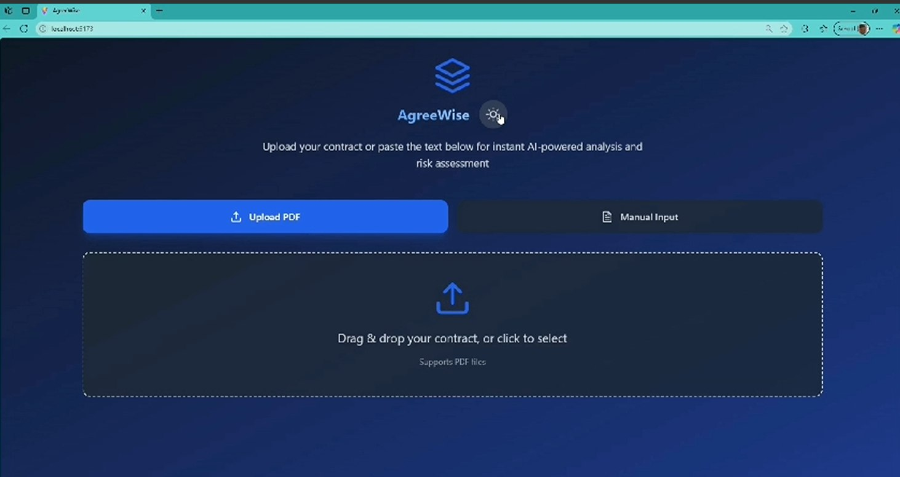

# AgreeWise

## Description
The **AgreeWise** is an intelligent tool designed to analyze legal contracts and highlight potential risks. Using advanced Natural Language Processing (NLP), it identifies risky clauses, assigns a risk score, and provides actionable insights to help users make informed decisions. Whether you're a business professional, legal expert, or someone who deals with contracts regularly, this tool simplifies contract review and ensures you don't miss critical details.

---

## Features
- **PDF Upload**: Upload a PDF contract for instant analysis.
- **Manual Text Input**: Paste contract text directly for quick review.
- **Risk Scoring**: Get a risk score (low, medium, high) based on the contract's content.
- **Crucial Points**: Identify problematic clauses like confidentiality, non-compete, termination, and more.
- **Final Verdict**: Receive a clear verdict on whether the contract is safe to proceed with.
- **User-Friendly Interface**: Simple and intuitive design for seamless user experience.

---

## Tech Stack
- **Frontend**: React, Tailwind CSS, Vite
- **Backend**: Flask, Python
- **NLP**: Keyword-based analysis with contextual understanding
- **Deployment**: Vercel (Frontend), Render/Heroku (Backend)

---

### Prerequisites
- Python 3.8+ (for backend)
- Node.js 16+ (for frontend)
- Git (for version control)

